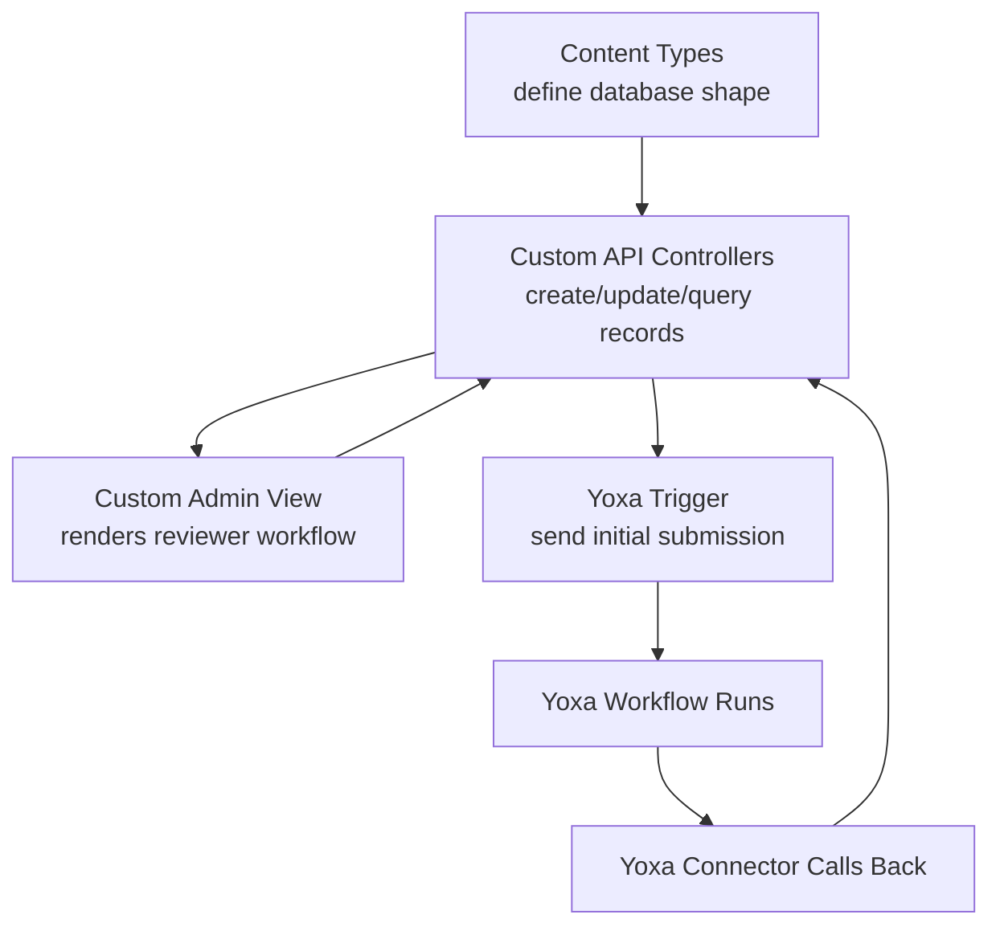
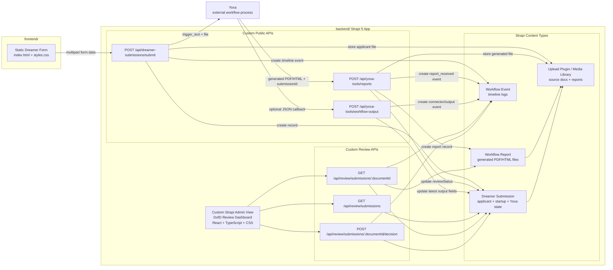

# DofD Strapi + Yoxa Architecture

## Implementation Layers

## Code-Level System Map

## Code Locations

- Content types: `backend/src/api/*/content-types/*/schema.json`
- Public Yoxa/form APIs: `backend/src/api/dreamer-submission` and `backend/src/api/yoxa-tools`
- Review dashboard APIs: `backend/src/api/review`
- Custom Strapi admin screen: `backend/src/admin/pages/DofdReview.tsx`
- Dashboard styling: `backend/src/admin/pages/DofdReview.css`
